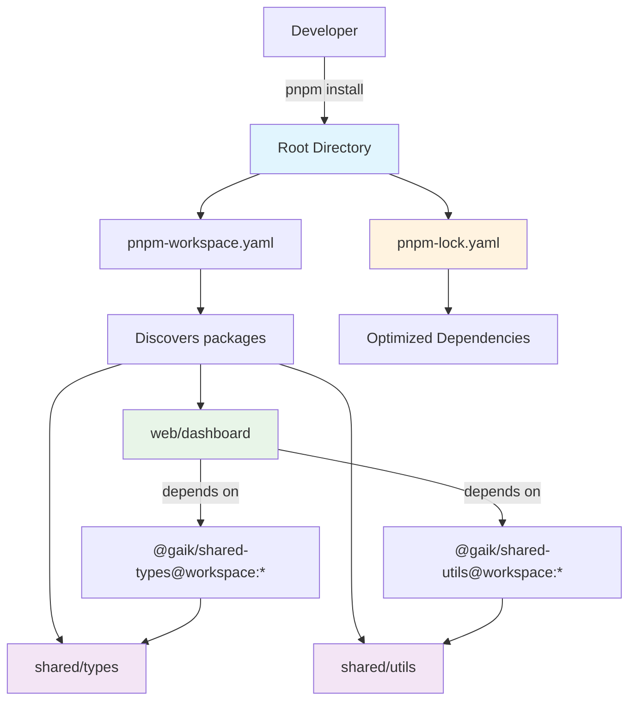

# GAIK Monorepo

Simple pnpm monorepo for GAIK applications.

## 📁 Structure

```
gaik-platform/
├── web/                    # Web applications
│   ├── dashboard/          # Next.js Dashboard with AI features
│   └── another-web-app/    # Other web applications
├── shared/                 # Shared code packages
│   ├── components/         # Shared React components
│   ├── types/              # TypeScript type definitions
│   ├── utils/              # Shared utilities
│   ├── auth/               # Authentication utilities (Supabase)
│   └── allas/              # CSC Allas (S3) client utilities
├── python/                 # Python applications (not managed by pnpm)
└── pnpm-workspace.yaml     # Workspace configuration
```

## 🚀 Quick Start

**Prerequisites:** Install pnpm package manager - [pnpm.io/installation](https://pnpm.io/installation)

**1. Install all workspace dependencies:**

```bash
pnpm install
```

This installs dependencies for all applications defined in `pnpm-workspace.yaml`.

**2. Develop individual applications:**

Navigate to specific app folders in `web/` and work with their individual `package.json`:

```bash
cd web/dashboard
pnpm dev
```

## 🔧 How it works

- **Monorepo management:** `pnpm install` at root optimizes shared dependencies across all apps
- **Individual development:** Each app in `web/` has its own `package.json` and can use different versions (e.g., different Next.js versions)
- **Shared packages:** Common code in `shared/` can be easily imported by web applications
- **Package manager:** Use ONLY pnpm for consistency - mixing npm and pnpm breaks dependency optimization
- **Opt-out:** To use different package manager, remove your app from `pnpm-workspace.yaml`

## ⚙️ Next.js Configuration

For Next.js apps using shared workspace packages, add this to your `next.config.js`:

```javascript
const nextConfig = {
  transpilePackages: [
    // Add only the packages you actually use in your app
    "@gaik/shared-utils", // Shared utility functions
    "@gaik/shared-types", // Shared TypeScript types
    "@gaik/shared-components", // Shared React components
    "@gaik/auth", // Authentication utilities
    "@gaik/allas", // CSC Allas (S3) utilities
  ],
};
```

This tells Next.js to transpile your local workspace packages during build time.

## 🎯 Beginner Tips

- **Start small:** Begin with the existing `dashboard` app in `web/dashboard/`
- **Shared packages:** Available packages: `@gaik/shared-types`, `@gaik/shared-utils`, `@gaik/shared-components`, `@gaik/auth`, and `@gaik/allas` - use only what you need
- **Development workflow:** Always run `pnpm install` at root first, then `cd` to your app folder
- **Hot reload:** Changes in `shared/` folders will trigger rebuilds in your Next.js apps
- **Import examples:**
  - `import { SomeType } from '@gaik/shared-types'`
  - `import { Button } from '@gaik/shared-components'`
  - `import { loginUser } from '@gaik/auth'`
  - `import { getFiles } from '@gaik/allas'`

## 📦 Package Management

### Adding Dependencies

```bash
# Add workspace packages (shared/) to specific app
cd web/dashboard
pnpm add @gaik/shared-types@workspace:*
pnpm add @gaik/auth@workspace:*
pnpm add @gaik/allas@workspace:*

# Add external packages to specific app only
cd web/dashboard
pnpm add react-icons

# Or use filters from root
pnpm --filter=dashboard add react-icons
```

### Key Points

- **One lock file:** Single `pnpm-lock.yaml` at root for all apps
- **App-specific deps:** Dependencies added in `web/dashboard/` only affect that app
- **Workspace packages:** Reference shared packages by their `package.json` name (e.g., `@gaik/shared-types`)
- **Filtering:** Use `--filter=<app-name>` to target commands to specific apps

### Benefits

✅ **Optimized installs** - Shared dependencies across apps  
✅ **Isolated apps** - Each app has its own dependencies  
✅ **Hot reload** - Changes in shared packages trigger rebuilds

## 📊 Monorepo Workflow


