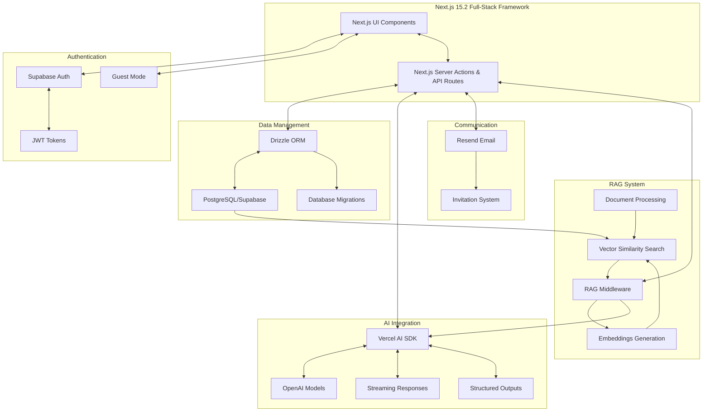

# GAIK Application

A modern web application for conversational AI, document management, and analytics, powered by RAG (Retrieval Augmented Generation) capabilities and built with Next.js 15.2 and React 19.

## Quick Start

The easiest way to get started is using the guest mode:

> **Note**: If you don't have pnpm installed, you can download it from https://pnpm.io/

```bash
# Install dependencies
pnpm install

# Run the setup script
pnpm app:setup
# Choose option 1 for easy setup

# Start the development server
pnpm dev
```

> **Note**: You can also use `npm` for all commands by replacing `pnpm` with `npm run` (e.g., `npm run app:setup` instead of `pnpm app:setup`).

Then navigate to [http://localhost:3000](http://localhost:3000) and click "Continue as Guest" on the login page.

You can access the chatbot directly at [http://localhost:3000/chatbot](http://localhost:3000/chatbot).

## Application Architecture



## Technology Stack

### Core Framework

- **Next.js 15.2**: Full-stack meta-framework that combines Node.js and React, featuring server components, server actions, and integrated API routes
- **shadcn/ui**: Component library for building the application interface
- **Vercel AI SDK**: Core toolkit for integrating AI capabilities, streaming responses, and building AI-powered applications

### Authentication

- **Supabase Auth**: User authentication with JWT tokens
- **Guest Mode**: Allow users to access features without authentication

### Database & ORM

- **PostgreSQL/Supabase**: Database for user data and vector embeddings
- **Drizzle ORM**: Type-safe ORM for database operations
- **PgVector**: Vector storage and similarity search for RAG functionality

### AI Integration

- **Vercel AI SDK**: Core tools for AI integration and streaming
- **OpenAI Models**: LLM capabilities for chatbot and text generation
- **Custom RAG Middleware**: Enhanced context-aware AI responses

### Storage

- **CSC Allas**: S3-compatible object storage for documents and files

### Communication

- **Resend**: Email delivery service for user invitations

## Detailed Architecture

### RAG (Retrieval Augmented Generation) System

The RAG capability is powered by:

1. **RAG Middleware** (`ai/middleware/`):

   - Intercepts user queries and enhances them with relevant context
   - Offers multiple strategies: HyDE (Hypothetical Document Embeddings) and Multi-stage RAG
   - HyDE generates hypothetical answers to improve retrieval accuracy
   - Adds retrieved document content to user prompts before sending to LLM

2. **Embeddings Generation**:

   - Creates vector embeddings for both documents and queries
   - Uses OpenAI's text-embedding-3-small model
   - Consistent vector dimensions (1536) for comparison

3. **Vector Similarity Search**:

   - Custom SQL function (`match_documents`) in PostgreSQL
   - Uses PgVector extension for efficient similarity calculations
   - Returns documents ranked by relevance score
   - Query executed via Supabase RPC call
   - Implemented in `ai/ai-actions/search.ts` which uses the Supabase function
   - **Important**: You need to create the `match_documents` function in your database using the SQL in `lib/db/function.sql`

4. **Document Processing**:
   - Files processed and chunked into manageable segments
   - Embeddings stored in PostgreSQL with metadata
   - Full document lifecycle management
   - New documents can be added via the API endpoint at `/api/seed`

### Vector Search Implementation

The `ai/ai-actions/search.ts` server action handles vector comparisons by:

1. Converting the user's query into an embedding vector using OpenAI's embedding model
2. Calling the `match_documents` Supabase function to find similar documents
3. Returning the most relevant documents based on similarity

```typescript
// Example from ai/ai-actions/search.ts
export async function searchDocuments(query: string, limit = 5): Promise<SearchDocument[]> {
  const supabase = createBrowserClient();
  try {
    // Generate embedding for the query
    const { embedding, usage } = await embed({
      model: openai.embedding("text-embedding-3-small"),
      value: query,
    });

    // Use match_documents function from lib/db/function.sql
    const { data, error } = await supabase.rpc("match_documents", {
      query_embedding: embedding,
      match_threshold: 0, // How similar the documents should be (0-1)
      match_count: limit, // How many documents to return
    });

    if (error) throw error;
    return data as SearchDocument[];
  } catch (error) {
    console.error("Error in searchDocuments:", error);
    throw error;
  }
}
```

### Adding Documents to the RAG System

You can add new documents to the database for use in the RAG system by using the `/api/seed` endpoint:

1. Send a POST request with a PDF file in a FormData object
2. The server will:
   - Process the PDF file to extract text and metadata
   - Split the text into manageable chunks
   - Generate embeddings for each chunk using OpenAI
   - Store the chunks and embeddings in the database

Example usage with `curl`:

```bash
curl -X POST http://localhost:3000/api/seed \
  -F "file=@/path/to/your/document.pdf"
```

Or using the Fetch API in JavaScript:

```javascript
const formData = new FormData();
formData.append('file', fileObject);

const response = await fetch('/api/seed', {
  method: 'POST',
  body: formData
});

const result = await response.json();
```

The document will then be available for retrieval in RAG-powered conversations.

### Authentication System

- **Supabase Auth**: Handles user authentication, session management
- **JWT Tokens**: Secures API requests and maintains user state
- **Guest Mode**: Cookie-based alternative to bypass authentication for simple use cases

### Database Management

- **Drizzle ORM**: Type-safe database access with automated migrations
- Key commands:
  - `db:push`: For quick schema updates (development)
  - `db:pull`: For reflecting database changes to Drizzle schema
  - `db:migrate`: For proper migration management in production

## Setup and Configuration

### Easy Setup (Guest Mode)

For a quick start with minimal configuration:

1. Run the setup script:

   ```bash
   npm run app:setup
   ```

2. Choose option 1 (Easy setup)

3. Optionally provide an OpenAI API key (for AI functionality)

4. Start the development server:

   ```bash
   npm run dev
   ```

5. Navigate to `http://localhost:3000` and click "Continue as Guest"

### Full Setup

For complete functionality including authentication, database, and file storage:

1. Run the setup script:

   ```bash
   pnpm app:setup
   ```

2. Choose option 2 (Full setup)

3. Provide credentials for:

   - Supabase (authentication)
   - Database (for RAG capabilities)
   - Allas S3 (file storage)
   - OpenAI (AI functionality)
   - Resend (email functionality)

4. Run database migrations:

   ```bash
   pnpm db:migrate
   ```

5. Start the development server:
   ```bash
   pnpm dev
   ```

### Setting up CSC Allas Service

For detailed instructions on setting up CSC Allas service and obtaining credentials, please refer to [lib/db/README.md](./lib/db/README.md).

### Setting up Resend for Email

1. Create an account at [Resend](https://resend.com/)
2. Add your domain or use Resend's test email capabilities
3. Add your API key to `.env.local`:
   ```
   RESEND_API_KEY=your_api_key
   ```

> **Note**: Without a proper domain setup, you can only send emails to your own verified email address during development.

For more detailed setup, see [Resend Next.js Documentation](https://resend.com/docs/send-with-nextjs).

## Command Reference

```bash
# Development
pnpm dev           # Start development server

# Setup
pnpm app:setup     # Configure application settings

# Database (needed for RAG functionality)
pnpm db:migrate    # Run database migrations
pnpm db:push       # Push schema to database
pnpm db:pull       # Pull schema from database
pnpm db:studio     # Open database explorer
pnpm db:seed       # Add admin user to db manually

# Email (for admin invitation feature)
pnpm email         # Start email preview server
pnpm email:export  # Export email templates
```

## Documentation References

- [Next.js 15.2 Documentation](https://nextjs.org/docs)
- [Drizzle ORM Documentation](https://orm.drizzle.team/)
- [Vercel AI SDK Documentation](https://sdk.vercel.ai/docs/ai-sdk-core/overview)
- [Supabase Documentation](https://supabase.io/docs)
- [Resend Documentation](https://resend.com/docs)
- [shadcn/ui Documentation](https://ui.shadcn.com/)

## Environment Variables

See `.env.example` for all available configuration options.
